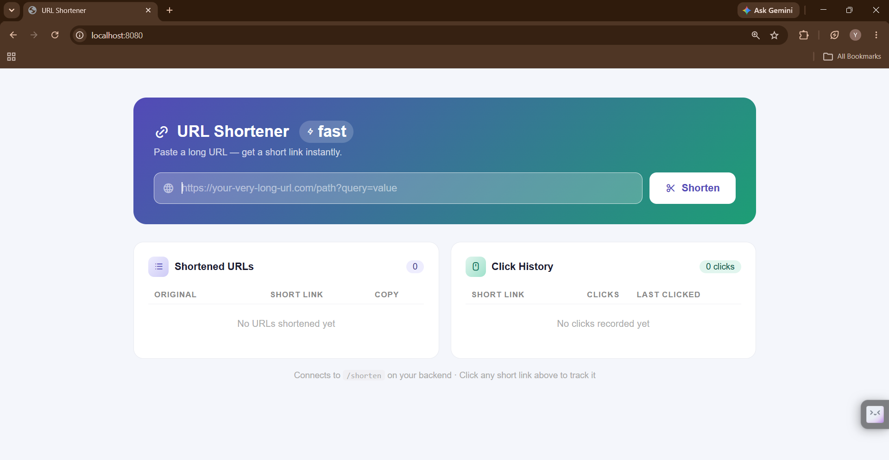
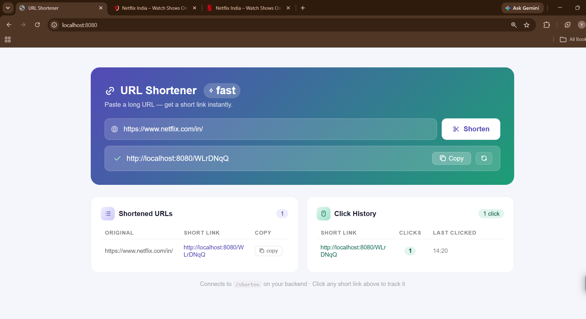
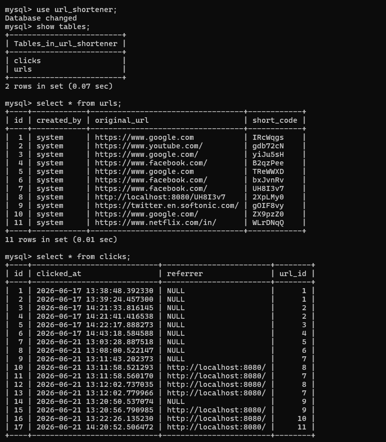

# 🔗 URL Shortener
A full-stack URL Shortener application built using **Spring Boot**, **MySQL**, **HTML**, **CSS**, and **JavaScript**. The application allows users to convert long URLs into short, shareable links and redirects users to the original URL when the short link is accessed.

## ✨ Features
* Generate short URLs from long URLs
* Redirect short URLs to original URLs
* Track clicks and store click information
* Responsive and modern user interface
* RESTful API implementation
* MySQL database integration

## 🛠️ Tech Stack
### Backend
* Java 17
* Spring Boot
* Spring Data JPA
* Maven

### Frontend
* HTML5
* CSS3
* JavaScript

### Database
* MySQL

### Tools
* Eclipse IDE
* Git & GitHub
* Postman

## 📂 Project Structure
src
├── main
│   ├── java
│   │   └── com.example.urlshortener
│   │       ├── controller
│   │       ├── dto
│   │       ├── entity
│   │       ├── repository
│   │       └── service
│   └── resources
│       ├── application.yml
│       └── static
│           ├── index.html
│           ├── css
│           │   └── style.css
│           └── js
│               └── script.js

## 📸 Screenshots

### Home Page

### Generated Short URL

### Database Records

## 🚀 Getting Started

### Clone the Repository
--bash
git clone https://github.com/BangarYB17/URL-Shortener.git
cd URL-Shortener

### Configure Database
Update "application.yml" with your MySQL credentials:
yaml
spring:
  datasource:
    url: jdbc:mysql://localhost:3306/url_shortener
    username: root
    password: your_password

### Run the Application
mvn spring-boot:run

Open in your browser:
http://localhost:8080

## 🔗 API Endpoints
| Method | Endpoint   | Description              |
| ------ | ---------- | ------------------------ |
| POST   | /shorten | Create a short URL       |
| GET    | /{code}  | Redirect to original URL |
| GET    | /test    | Test controller          |

## 🎯 Future Improvements
* User authentication and login
* Custom short URLs
* URL expiration feature
* Analytics dashboard
* Docker deployment
* QR code generation

## 👨‍💻 Author
**Yogeshwar Bangar**
* GitHub: https://github.com/BangarYB17
* Repository: https://github.com/BangarYB17/URL-Shortener
---
⭐ If you found this project useful, please give it a star!
